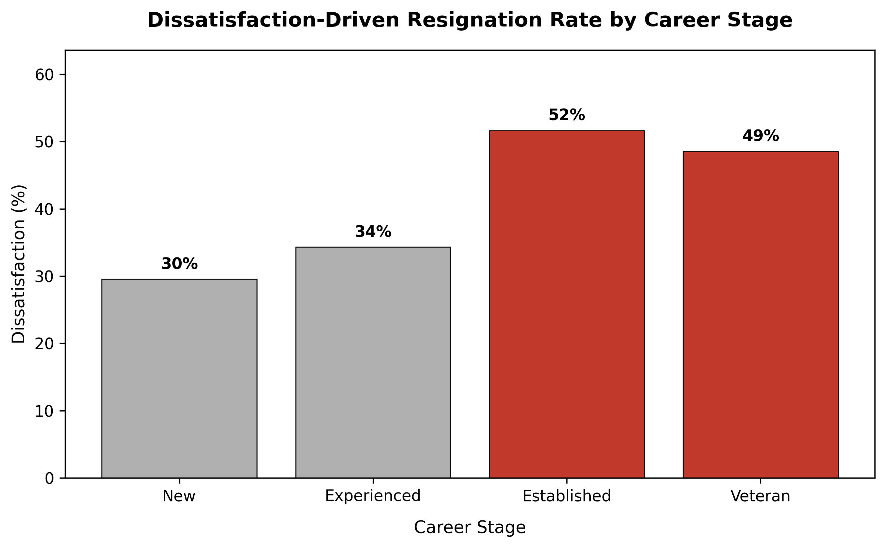

<div align="center">

# 📊 Employee Turnover Analysis

[](https://www.python.org/)
[](https://pandas.pydata.org/)
[](https://matplotlib.org/)

</div>

---

## 📌 Business Problem & Key Objectives

When employees leave an organization, understanding **why** is critical to retaining talent. However, the Department of Education, Training and Employment (**[DETE](data/dete_survey.csv)**) and the Technical and Further Education (**[TAFE](data/tafe_survey.csv)**) institute in Queensland, Australia, tracked exits using entirely different survey formats and schema.

This project unifies and standardizes over 1,500 exit survey responses to identify whether employee turnover due to dissatisfaction is driven by short tenure or mid-to-late career friction.

### Core Goals
* **🧹 Unify & Clean:** Harmonize disparate survey schemas, missing values, and column names into a single clean dataset.
* **📐 Vectorize Dissatisfaction:** Combine 9 distinct survey indicators into a unified dissatisfaction metric.
* **🎯 Career Stage Segmentation:** Evaluate how resignation rates shift across 4 distinct service categories.

---

## 📊 Key Insights & Visualizations

### Dissatisfaction Resignation Rate by Career Stage

<div align="center">
  
</div>

> [!NOTE]
> * **Tenure Scalability:** Dissatisfaction-driven resignations scale directly with length of service. 
> * **Experienced Drop-off:** Tenured staff (**Established** & **Veterans**) resign due to workplace dissatisfaction at nearly **double the rate** of entry-level hires.

---

### Resignation Breakdown by Group

| Career Stage | Service Length | Dissatisfaction Resignation Rate | Primary Friction Factors |
| :--- | :--- | :---: | :--- |
| **New** | Less than 3 years | **~29%** | Career changes, relocation, personal reasons |
| **Experienced** | 3 to 6 years | **~34%** | Role progression, workload demands |
| **Established** | 7 to 10 years | **~51%** | Burnout, work-life balance, environment |
| **Veteran** | 11+ years | **~48%** | Leadership style, lack of recognition, workplace fatigue |

---

## 💡 Final Conclusion & Recommendations

> [!TIP]
> ### 🏆 Strategic Focus: Mid-to-Late Career Retention
> Early-career turnover (<3 years) is mostly natural attrition. The primary operational risk is the departure of **Established (7–10 yrs)** and **Veteran (11+ yrs)** personnel due to preventable work-environment dissatisfaction.

### 🚀 Proposed Retention Strategy
* **🔄 Conduct Mid-Career Check-Ins (Years 5–7): Run structured stay interviews and workload audits around year 5 and year 7 to spot burnout before staff decide to leave.
* **⚖️ Support Work-Life Balance for Senior Staff: Offer flexible work options and targeted burnout prevention programs specifically designed for long-tenured employees.
* **📢 Leadership Feedback Loops:** Conduct exit interview follow-ups focused on department culture, targeting DETE departments where dissatisfaction spikes.

---

## 🛠️ Tools & Tech Stack

```text
Language     :  Python 3.10+
Data Wrangling:  Pandas, NumPy
Visualizations:  Matplotlib, Seaborn
Environment  :  Jupyter Notebook / VS Code
```

---

## 📁 Repository Structure

```text
employee-exit-analysis/
├── data/                # Raw survey datasets (DETE & TAFE)
├── notebooks/           # Cleaned, step-by-step Jupyter analysis
│   └── analysis.ipynb
├── visuals/             # Exported high-res charts and plots
├── .gitignore           # Git ignore rules
└── README.md            # Documentation
└── requirements.txt    # Project dependencies
```

---

## 🚀 How to Run the Project Locally

1. **Clone the repository:**
   ```bash
   git clone  https://github.com/Kash4Code/employee-turnover-analysis.git
   cd employee-turnover-analysis
   ```
   
2. **Set up a virtual environment**
   ```bash
   python -m venv venv
   # Activate on Windows:
   .\venv\Scripts\Activate.ps1
   # Activate on Mac/Linux:
   source venv/bin/activate
   ```
   
2. **Install dependencies:**
   ```bash
   pip install -r requirements.txt
   ```

3. **Run the analysis:**
   Open `notebooks/analysis.ipynb` in Jupyter Notebook or VS Code and execute all cells.

---

## 🌟 Support & Feedback

If you found this project helpful or insightful, please consider **starring** ⭐ the repository and **forking** 🍴 it to build upon it!

Have suggestions or feedback? Feel free to open an issue or connect with me:

[](https://github.com/Kash4Code)
[](https://www.linkedin.com/in/kashinathrp/)
